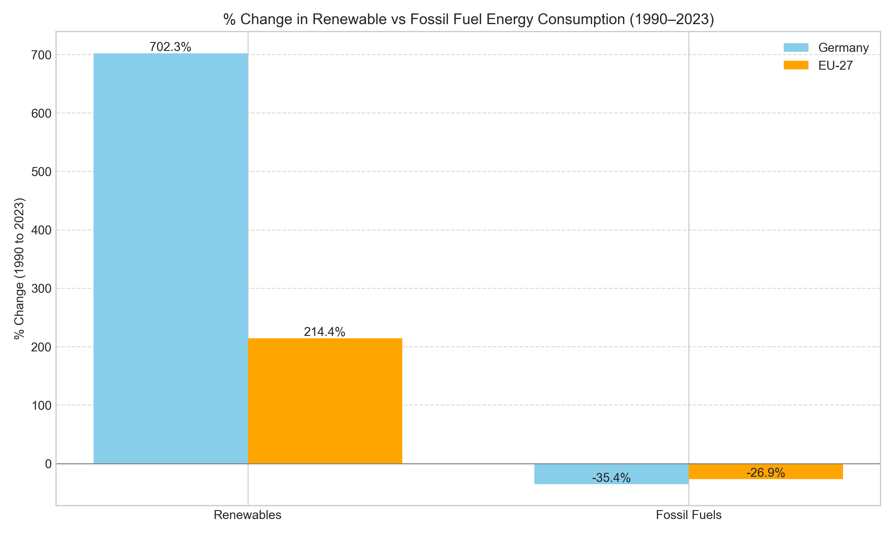
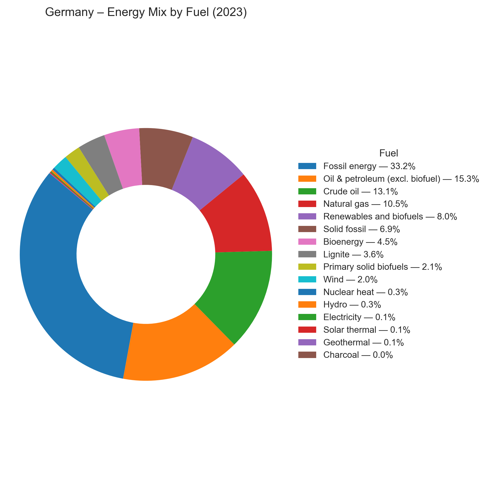
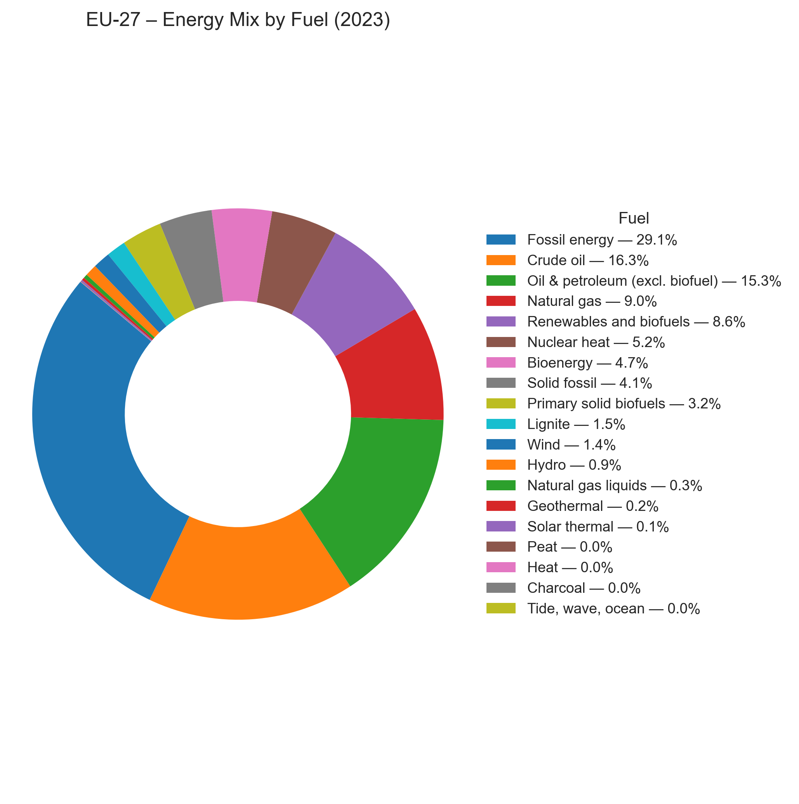

# 📩 Germany vs EU: Energy Trends & Renewable Transition (1990–2023)
A data-driven exploration of Germany’s energy transition over the past three decades, focusing on its shift from fossil fuels to renewables. This project compares Germany’s trajectory with the EU-27 average, highlighting key trends, policy impacts, and fuel-specific insights. Through clean visual storytelling, it showcases Germany’s distinctive role in shaping Europe’s sustainable energy future.

---
## 🎯 Project Overview
This project analyses and compares the energy consumption trends of Germany and the European Union (EU-27) from 1990 to 2023, focusing on the transition from fossil fuels to renewable sources.
Through fuel-wise analysis, visual storytelling, and policy-event annotations, we aim to answer:
- How has Germany's renewable adoption differed from the EU average?
- What role did major global events and policies, such as Kyoto, Fukushima, and the Ukraine crisis, play?
- Is Germany ahead of or behind in terms of reducing its dependency on fossil fuels?
  
The project uses Eurostat’s official datasets, ensuring reliability and comparability over three decades of energy data.

---

## 💡 Key Questions This Project Answers
- How has Germany’s energy consumption evolved from 1990 to 2023?
- How does Germany’s energy mix compare with the EU average?
- What policy events (Kyoto, Paris, Nuclear Exit, Russia-Ukraine crisis) impacted the energy transition?
- Which fuel types saw the sharpest rise or decline over time?
- What does the final energy mix look like in 2023 for Germany and the EU?

---

## 📊 Data Source
This project uses official datasets from Eurostat, covering energy balances and renewable energy shares for both Germany and the EU-27.

| Dataset         | Description                                                                                                                         | Link                                                                                                             |
| --------------- | ----------------------------------------------------------------------------------------------------------------------------------- | ---------------------------------------------------------------------------------------------------------------- |
|  nrg_bal_c      | Detailed energy balances by fuel type and country (1990–2023). Used for analysing consumption trends of fossil and renewable fuels. | [Eurostat – nrg\_bal\_c](https://ec.europa.eu/eurostat/databrowser/view/nrg_bal_c/default/table?lang=en)         |
|  nrg_ind_share  | Share of energy from renewable sources in gross final consumption (%), 2004–2023.                                                   | [Eurostat – nrg\_ind\_share](https://ec.europa.eu/eurostat/databrowser/view/nrg_ind_share/default/table?lang=en) |

---

## 🧰 Tools Used

 Tools & Technologies
- Python – Data cleaning, transformation, analysis
- Pandas – Data manipulation, pivoting, grouping
- Matplotlib & Seaborn – Advanced visualisations and annotations
- Jupyter Notebook – Exploratory analysis & documentation
- Git & GitHub – Version control and project publishing

---

## 📒 Methodology
1. Loaded and cleaned datasets from Eurostat (nrg_bal_c, nrg_ind_share) covering 1990–2023.

2. Filtered for Germany and EU-27, focusing on Gross Inland Consumption and Renewables Share (%).

3. Pivoted and reshaped data for fuel-wise comparison (Bioenergy, Wind, Solar, Nuclear, Fossils, etc.).

4. Created clean, comparative visualisations:
 - Germany vs EU: Bioenergy vs Solid Fossil Fuels
 - Wind, Hydro, Solar Thermal, Oil, Natural Gas, and Nuclear Heat
 - Total Renewable vs Fossil Energy Consumption

5. Added key policy/event annotations:
 - Kyoto Protocol, Energiewende, Fukushima Nuclear Exit, Paris Agreement, and Ukraine Crisis

6. Designed high-level summary visuals:
 - % Change in Renewables vs Fossils (1990–2023)
 - Final 2023 energy mix (pie charts + grouped bar)

7. Packaged insights and trends inside Jupyter notebooks with markdown and commentary.

8. Exported processed datasets and visuals for reuse, publishing, or extension (API, dashboard, etc.)

---

## 📸 Visual Highlights
**1. Grouped Bar Chart: % Change in Renewables vs Fossil Fuels (1990–2023)**
Shows comparative progress of Germany and the EU in energy transition.


**2. Germany vs EU - Renewable Share(%) (2004–2023)**

Demonstrates how Germany led the renewable growth in recent years.


**3. Final Energy Mix (2023) - Pie Charts**
Visual summary of current fuel breakdowns for both Germany and the EU.
<div align="center">


</div>

---

## 📌 Key Insights
- Germany has significantly increased its bioenergy and wind usage since the 2000s.  
- Solid fossil fuels have sharply declined in Germany, faster than the EU average.  
- Wind energy grew more rapidly in Germany post-2000, signalling strong policy backing.  
- Germany’s overall renewable shift is steeper than the EU average.  
- Solar Thermal has shown late but steady growth since the mid-2000s.

(*Detailed insights for each chart are added inside the Jupyter notebook.*)

---

## 🏛️ Policy Impact Summary
- **1997 – Kyoto Protocol**: Triggered early awareness on fossil reductions.  
- **2000 – Energiewende Begins**: Marked Germany’s major renewable energy reforms.  
- **2015 – Paris Agreement**: Boosted global and EU-wide renewable commitments.  
- **2022 – Russia-Ukraine War**: Spiked urgency for energy independence → seen in recent trends.

Policy annotations help highlight the cause-and-effect of real-world events.

---
## 📁 Folder Structure

```
/data/
  germany_energy.csv
  eu_energy.csv

/notebooks/
  germany_vs_eu.ipynb

/visuals/
  *.png (All visual outputs)

README.md
```
---

## ▶️ How to Run

1. Clone this repository:
   ```
   git clone https://github.com/yourusername/energy-trends-germany-eu.git
   cd energy-trends-germany-eu
   ```
2. Install required packages:
   ```bash
   pip install pandas matplotlib jupyter
   ```
3. Launch the notebook:
   ```bash
   jupyter notebook
   ```
4. Open `notebooks/germany_vs_eu.ipynb` and run cells in order.

---

## ✅ Skills Demonstrated

- **Data Analysis & Cleaning**: Hands-on work with Eurostat datasets (`nrg_bal_c`, `nrg_ind_share`) involving filtering, pivoting, reshaping, and cleaning complex energy data.
- **Data Visualisation**: Created clear, comparative plots using Matplotlib & Seaborn — including time-series trends, grouped bars, and custom pie charts.
- **Insight Derivation**: Interpreted energy trends across decades, comparing Germany and the EU in terms of renewable adoption, fossil fuel decline, and policy impacts.
- **Structured Jupyter Notebook Workflow**: Maintained a clean, modular project structure with reusable code blocks and markdown documentation.
- **Version Control & GitHub**: Practised collaborative coding and version tracking using GitHub repositories and README enhancements.

---

## 🎯 Outcome & Impact

This project presents a clear, visual, and data-driven narrative of how **Germany has transitioned to cleaner energy more rapidly than the EU average**, while also highlighting regional energy diversity. It strengthens my portfolio as a **data analyst with energy domain knowledge**, and sets a foundation for possible future extensions like:
- Interactive dashboards (Power BI, Plotly Dash, or React-based visualizers)
- API integration with live Eurostat data
- Country-level comparison beyond Germany

---
## 📝 Conclusion

Germany's renewable energy trajectory is clearly more focused and steeper than the EU average.  We were able to see how Germany gradually reduced its reliance on nuclear and solid fossil fuels while quickly increasing the use of wind and biofuels through fuel-wise breakdowns, policy overlays, and comparison visualisations.  Despite being steady, EU-wide success shows a more varied mix of member country tactics.

In addition to visualising the data-supported narrative of Germany's energy transformation, this project provides a reusable framework for future energy dashboards and comparative policy research.

 ---

## 🙌 Credits
- Dataset: [Eurostat – Energy Balances](https://ec.europa.eu/eurostat/databrowser/view/nrg_bal_c/default/table)
- Visual inspiration from EU energy dashboards.
- Developed by [Devansh Negi](https://github.com/Dev-N-UK07) 
